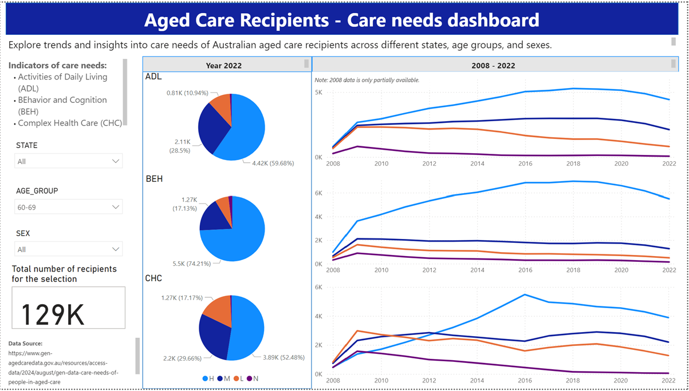

# Aged Care Recipeints of Austrlia - Needs analysis

## Background
I recently conducted some analysis care needs for aged care recipients in Australia, combining my interest in real-world data with my technical skills.

## Data
From year 2008-2022.
Data source: [Care needs of people in aged care dataset from the Aged Care Quality and Safety Commission website](https://www.gen-agedcaredata.gov.au/resources/access-data/2024/august/gen-data-care-needs-of-people-in-aged-care)

## Indicators of care needs:
- Activities of Daily Living (ADL)
- BEhavior and Cognition (BEH)
- Complex Health Care (CHC)

## Analysis
- Areas of analysis
  - Changes to ADL, BEH and CHC in terms of different need levels over the years (2008-2022) - line charts in R
  - Latest status of ADL, BEH AND CHC in terms of different need levels (high, medium, low and null) -pie charts in PowerBI

- Code (in R) : [Aged care needs analysis](Aged_Care_Needs_Analysis.ipynb)

## Dashboard in PowerBI
- I created a PowerBI dashboard to explore trends and insights into above mentioned care needs of Australian aged care recipients across different states, age groups, and sexes.
- This is currently published in my own workspace, and might not be visible publicly.
- Below is a screen shot of the dashbaord. 

## Next steps
- Publish the dashboard in PowerBI (check for options like PowerBI Premium License). 
- Since the care indicators have changed from 2023, the next step would be to amalgamate the new data into the analysis. 
